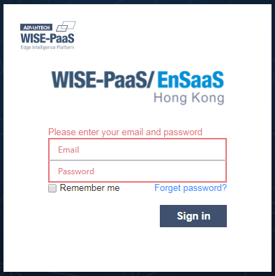
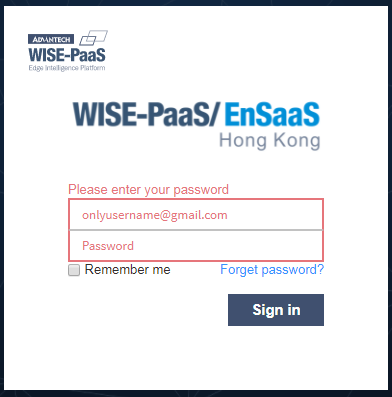
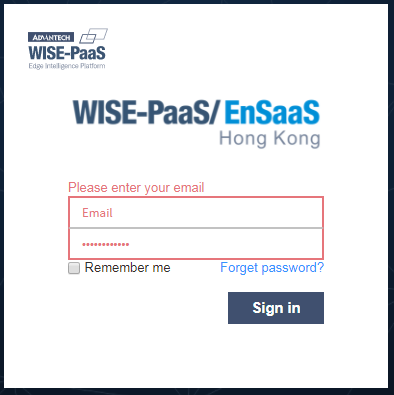
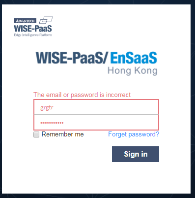

# CHANGELOG

## v1.0.3

1. [IE11]解決使用Flexbox置中logo問題 -2017/11/24

2. 將logo圖片改成png格式，修正css對應內容，調整input placeholder字體大小

3. 帳號長度<254，密碼長度8-20

4. 登入驗證

### 以下情況可以透過點擊Sign in按鈕或是直接按Enter鍵實踐

| 情形 | 示意圖 | 文字說明 |
|-------|-------|-------|
| 帳號密碼皆為空 |  | 顯示`Please enter your email and password` |
| 僅輸入帳號 |  | 顯示`Please enter your password` |
| 僅輸入密碼|  | 顯示`Please enter your email` |
| 帳密皆輸入，但登入失敗|  | 顯示`The email or password is incorrect` |

## v1.0.4
1. 新增forget password畫面(`wisepaas-login_template_forgetpwd.html`, `wisepaas-login_template_forgetpwd.css`)
2. 新增第一次sso登入change password畫面(`wisepaas-login_template_changepwd.html`, `wisepaas-login_template_changepwd.css`)
3. 將Login Template中共有的css放入`wisepaas-login_template.css`，其餘css依各畫面分門別類
4. 更正login page畫面中`Forget password?`及`Remember me`的css style
5. 新增login page的sign up描述與連結
6. 於`wisepaas-login_template.css`新增一個css class稱為`login-invalid`，定義錯誤狀態時placeholder的顏色，移除此class則恢復預設狀態
7. 新增sign up畫面
8. WISE-PaaS Login page-V.3.1.pptx是Login Template的設計準則
9. SRP登陸頁面整理描述Login page的user flow
10. 使用`particles.js`生成背景

## v1.0.5
1. 變更淺色背景css(請見`wisepaas-login_tempalte.css`)
2. 新增按下Sign in, Sign up, Reset Password與Change Password等按鈕時的loading效果說明(請見`README 第6點`)

## v1.0.6
1. 修正無法顯示各國電話號碼問題

## v1.0.7
1. 取消所有`-first`命名字串
2. 新增`http-server`方便開發(`npm install && npm run dev`)

## v1.0.8
1. 新增pop-up dialog(註冊與忘記密碼需要)