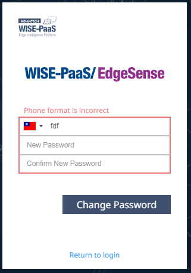
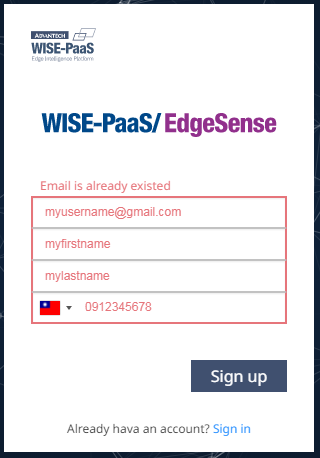

# README


0. pop-up dialog用於註冊與忘記密碼(請參考SRP登陸頁整理ppt)，請參考範本`wisepaas-login_template_popupdialog.html`與`js/popup-dialog.js`。**(請注意：不要改動pop-up dialog位置)** 

1. `npm install && npm run dev`: 開啟簡單的http server，預設port是8888，詳細內容請見`package.json`。

2. 請自行更改``內容。

3. 請自行更改`<div id="login-message">Sign in to Cloud RMM Network</div>`內容。

4. 理論上，CSS不需要再調整。(註:預設是深色背景，淺色背景請至`css/wisepaas-login_template.css`第34行做更改，詳細情況請見該行註解)

5. login form狀態顏色規範：

    |狀態|正常|錯誤|
    |---|---|---|
    |外框|#C2C2C2(focus: #99CAFF)|#E6757B|
    |placeholder|預設|#E6757B|
    |內框文字|#000|#E6757B|

6. login form 驗證規範:

    ### Phone格式錯誤顯示(這個不須點擊按紐就可以提前顯示)(請見`js/intl-tel-input-config.js`)

    | 情形 | 示意圖 | 文字說明 |
    |-------|-------|-------|
    | Phone格式錯誤 |  | 顯示`Phone format is incorrect` |

    ### 以下情況可以透過點擊按鈕或是直接按Enter鍵實踐

    ### 登入

    | 情形 | 示意圖 | 文字說明 |
    |-------|-------|-------|
    | 沒輸入Email |  | 顯示`Please enter your email` |
    | 沒輸入Password |  | 顯示`Please enter your password` |
    | Email,Password皆輸入，但其一有誤 |  | 顯示`The email or password is incorrect` |

    ### 註冊

    | 情形 | 示意圖 | 文字說明 |
    |-------|-------|-------|
    | 沒輸入Email |  | 顯示`Please enter your email` |
    | 沒輸入First Name |  | 顯示`Please enter your first name` |
    | 沒輸入Last Name |  | 顯示`Please enter your last name` |
    | 沒輸入Phone |  | 顯示`Please enter your phone` |
    | Email已存在 |  | 顯示`Email is already existed` |

    ### 忘記密碼

    | 情形 | 示意圖 | 文字說明 |
    |-------|-------|-------|
    | 沒輸入Email |  | 顯示`Please enter your email` |
    | 沒輸入Phone |  | 顯示`Please enter your phone` |
    | Email,Phone皆輸入，但其一有誤 |  | 顯示`The email or phone is incorrect` |

    ### 第一次登入修改密碼

    | 情形 | 示意圖 | 文字說明 |
    |-------|-------|-------|
    | 沒輸入Phone |  | 顯示`Please enter your phone` |
    | 沒輸入New Password |  | 顯示`Please enter your new password` |
    | New Password與Confirm New Password不一致|  | 顯示`Two passwords are not the same` |
    | Phone,New Password皆輸入也一致，但Phone有誤 |  | 顯示`The phone is incorrect` |

7. 按下Sign in, Sign up, Reset Password與Change Password等按鈕時，按鈕內文清空，並新增以下css class產生font-awesome的animated icon效果。

    ``` html         
    <!-- before --> 
    <div id="login-btn">
        <span class="noselect">Sign in</span>
    </div>

    <!-- after -->
    <div id="login-btn">
        <span class="noselect fa fa-spinner fa-pulse"></span>
    </div>
    ```

